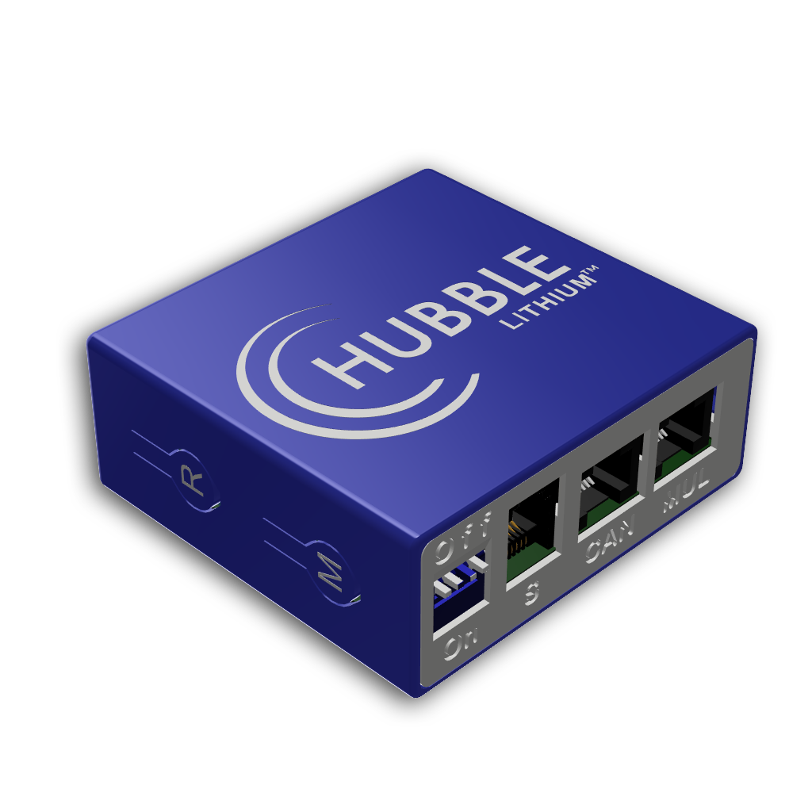

# HomeAssistant: Hubble Cloudlink Data Logger

    

This add-on for HomeAssistant connects the data from your Hubble Cloudlink (Riot Systems) dashboard to HomeAssistant entities.

Data is fetched from the Cloud, so this requires internet access.