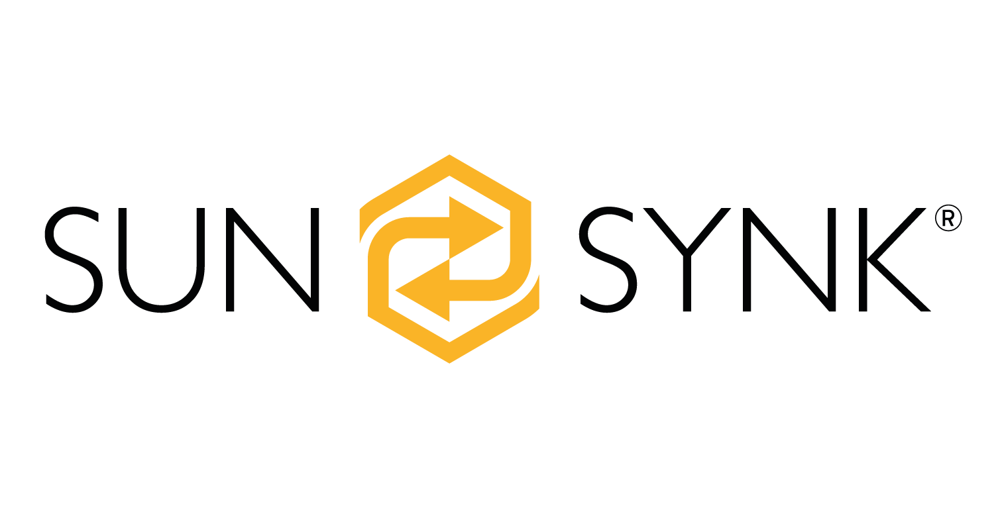

# HomeAssistant: SunSync Data Logger

This add-on for HomeAssistant connects the data from your SunSynk inverter to HomeAssistant entities. The data is fetched from the SunSynk cloud, so updates are not fast (usually updates every 5 minutes).